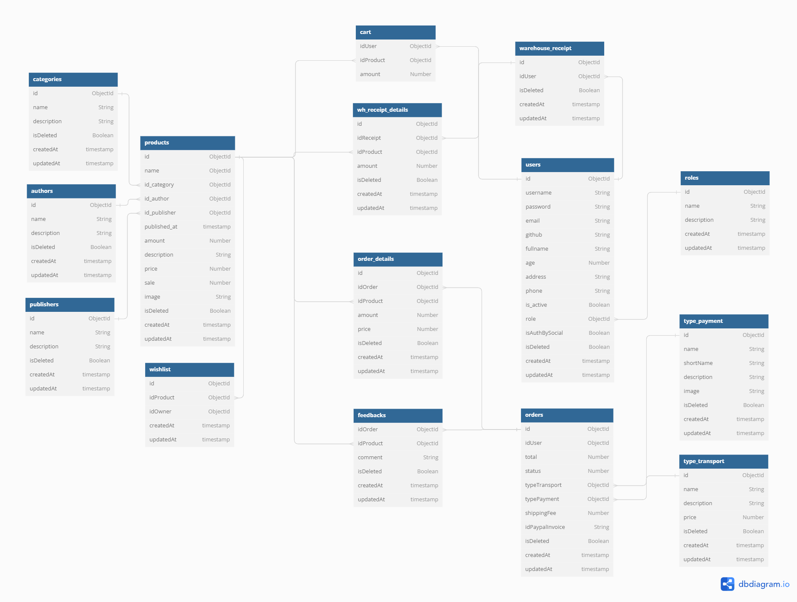

<!-- PROJECT LOGO -->
<a name="readme-top"></a>
<div align="center">
  <a href="https://github.com/krulzilla/bookshop-ec">
    
  </a>

<h3 align="center">K-zilla Bookshop</h3>

  <p align="center">
    A project using ExpressJS, MongoDB, EJS view engine
    <br />
    <a href="https://bookshop-ec.onrender.com"><strong>View Demo »</strong></a>
    <br />
  </p>
</div>


<!-- TABLE OF CONTENTS -->
<details>
  <summary>Table of Contents</summary>
  <ol>
    <li>
      <a href="#about-the-project">About The Project</a>
      <ul>
        <li><a href="#built-with">Built With</a></li>
      </ul>
    </li>
    <li>
      <a href="#getting-started">Getting Started</a>
      <ul>
        <li><a href="#try-with-demo">Try with demo</a></li>
        <li><a href="#install-in-local">Install in local</a></li>
      </ul>
    </li>
  </ol>
</details>


<!-- ABOUT THE PROJECT -->
## About The Project

A personal NodeJs project using ExpressJS, MongoDB, EJS view engine. Project is a bookstore online.
<br>


Project inludes: 
* Client side
* Admin side ("/admincp")
* Staff side ("/staffcp")

More details you can read <a href="https://docs.google.com/document/d/1Irczckadw9leeAo0T4ZUQEMM3F3VKEfYb8peqNJKiWk/edit">here</a>

<p align="right">(<a href="#readme-top">back to top</a>)</p>


### Built With

<strong>Backend</strong>

* [![Node][Node.js]][Node-url]
* [![Express][Express.js]][Express-url]
* [![MongoDB][MongoDB]][MongoDB-url]
  
<strong>Frontend</strong>
  
* [![Bootstrap][Bootstrap.com]][Bootstrap-url]
* [![EJS][EJS]][EJS-url]

<p align="right">(<a href="#readme-top">back to top</a>)</p>


<!-- GETTING STARTED -->
## Getting Started

### Try with demo
* In client side, you can access from <a href="https://bookshop-ec.onrender.com">here</a>
* If you want to try pay with paypal, you can use sandbox paypal account.
<br><br>
* In admin side, you can access from <a href="https://bookshop-ec.onrender.com/admincp">here</a>
* Use admin account to login: sa - 123.
<br><br>
* In staff side, you can access from <a href="https://bookshop-ec.onrender.com">here</a>
* Use staff account to login: staff_user_1 - 123.

### Install in local

_Follow these steps  to install project in local_

1. Clone the repo
   ```sh
   git clone https://github.com/krulzilla/bookshop-ec
   ```
2. Install NPM packages
   ```sh
   npm install
   ```
3. Create your .env from .env.example   
4. Start project
   ```js
   npm run dev || npm start
   ```

<p align="right">(<a href="#readme-top">back to top</a>)</p>

<!-- MARKDOWN LINKS & IMAGES -->
[Express.js]: https://img.shields.io/badge/express.js-%23404d59.svg?style=for-the-badge&logo=express&logoColor=%2361DAFB
[Express-url]: https://expressjs.com/
[Node.js]: https://img.shields.io/badge/node.js-6DA55F?style=for-the-badge&logo=node.js&logoColor=white
[Node-url]: https://nodejs.org/en
[MongoDB]: https://img.shields.io/badge/MongoDB-%234ea94b.svg?style=for-the-badge&logo=mongodb&logoColor=white
[MongoDB-url]: https://www.mongodb.com/
[Bootstrap.com]: https://img.shields.io/badge/Bootstrap-563D7C?style=for-the-badge&logo=bootstrap&logoColor=white
[Bootstrap-url]: https://getbootstrap.com
[EJS]: https://img.shields.io/badge/EJS-0769AD?style=for-the-badge&logoColor=white
[EJS-url]: https://www.npmjs.com/package/ejs